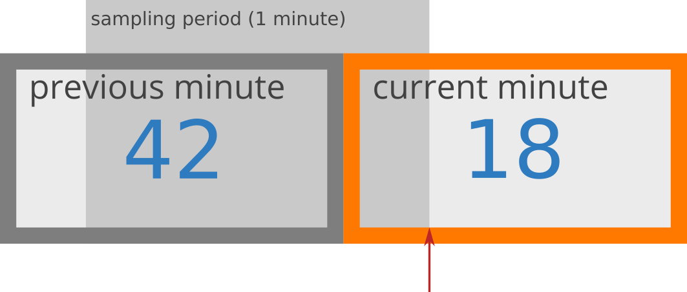

## Synopsis

```
sudo apt install build-essential clang libapr1 libapr1-dev libelf-dev m4 pkg-config libz-dev
make
sudo ./xdpfilter
```

## Introduction

This application uses XDP to drop packets from hosts that send a certain amount of SYN packets within a certain time period.

## Dependencies

This was developed on an Ubuntu 20.04.1 Amazon EC2 instance, running Linux kernel 5.11.0-1022-aws. It should work on any Linux system running 5.8 or higher (5.8 being [necessary](https://nakryiko.com/posts/bpf-ringbuf/#bpf-ringbuf-vs-bpf-perfbuf) for the BPF ring buffer. See also: [BPF features by kernel version](https://github.com/iovisor/bcc/blob/master/docs/kernel-versions.md)).

Libbpf provides a vmlinux.h header file (vmlinux_511.h for us, symlinked to vmlinux.h), which is designed to smooth over differences across kernel versions. Libbpf provides one based on Linux 5.8, but I've generated one based on 5.11. Regardless, the header itself should cause Clang to to generate BPF CO-RE relocations, allowing our libbpf application to run on arbitrary kernel versions.

The package and kernel dependencies are as follows:

build-essential\
clang>=10\
libapr1\
libapr1-dev\
libelf-dev (libbpf dependency)\
linux>=5.8\
m4\
make\
pkg-config\
libz-dev (libbpf dependency)

To install on Debian-based systems:

```
sudo apt install build-essential clang libapr1 libapr1-dev libelf-dev m4 pkg-config libz-dev
```

Some are necessary for the application itself, and others are for the vendored dependencies.

The code was tested on both clang-10 and clang-12. (I initially started developing with clang-12, then verified that downgrading to clang-10, the version provided by the `clang` package on Ubuntu, continued to work, which it does.) Presumably, it should work on clang-11, but that is untested.

### libbpf

I vendor libbpf as a submodule. Some package repositories provide it, but vendoring ensures that this code will always use a more up-to-date version.

### xdp-tools

Similarly, I vendor xdp-tools as a submodule, although that's more out of necessity to provide libxdp, because the Ubuntu repositories don't seem to have it packaged. Therefore, building it is required.

## The Algorithm

At first, I explored a few different ways of counting SYN requests and determining how many occurred within a sliding window, such as a ring buffer with a certain number of buckets representing slices of a time period. This works fine, but as I explored it further, I became concerned with the amount of space the bookkeeping would require, especially if a bad actor decided to send a large number of packets.

Instead, I did some more research and found an interesting solution that [Cloudflare had written about](https://blog.cloudflare.com/counting-things-a-lot-of-different-things/), which involves keeping track of packet counts (per host) for just two time periods: a "current" period and a "previous" period. Then, to compute an approximation of the sliding window, you multiply the count of events in the previous time period with the percentage of the previous time period that is no longer "relevant". For example, if the sampling period is one minute, and you're already 20 seconds into the current minute, the previous minute's count would be multiplied by 0.67 (67%). Finally, you add the total count in the current time period to that value, and that's your count approximation for the sliding window. Cloudflare provides a helpful image:



For Cloudflare's example, the arithmetic looks like this:

```
rate = 42 * ((60-15)/60) + 18
     = 42 * 0.75 + 18
     = 49.5 requests
```

This method rests on a few assumptions, such as expecting that you receive packets relatively uniformly, but Cloudflare notes that, in practice, it works remarkably well. In my opinion, one nice feature of this algorithm is that your time windows can easily be any arbitrary size, and you only ever need two of them, since you only have to maintain a previous and a current count per host.

## The Implementation

### Userland

I decided to do the userland portion in C, partially because it made using libbpf easier, and partially because I haven't written userland C in a while and I really enjoy it.

I leaned heavily on blog posts and reference material by Andrii Nakryiko, who is one of the authors (if not _the_ author) of libbpf. He also maintains a set of tools called [libbpf-bootstrap](https://github.com/libbpf/libbpf-bootstrap), which provides skeletons and helpful functionality for getting started with libbpf. I used the `bootstrap` example of libbpf-bootstrap to scaffold out this project.

### Kernel

The kernel part is the most straightforward: I take apart packet headers until I can grab TCP flags and check for SYNs (but not SYN ACKs). Along the way, I grab the source IP, destination IP, and destination port to send to userspace for bookkeeping and output.

One note, which I noted in the comments, is that, in the interest of time, I chose to elide handling VLAN and VLAN-within-VLAN Ethernet packets. To make this work for any network traffic, I would have to adjust the IP header offset by a variable amount, depending on the 802.11q/802.11ad header(s).

## Considerations

## Improvements

I definitely want to improve error handling. Admittedly, I'm making certain happy-path assumptions in spots, which are absolutely not guaranteed to be happy paths.
